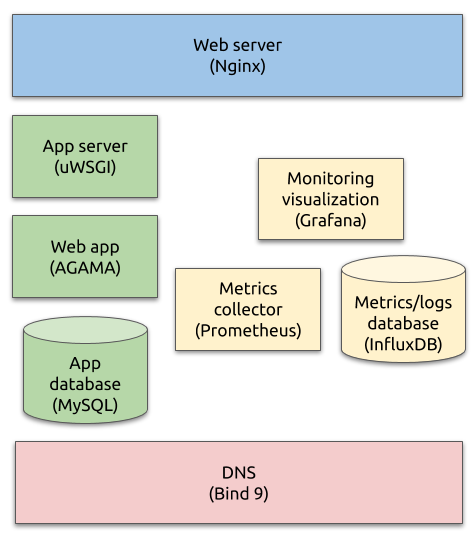

# ica0002

This is a small, but complete, IT infrastructure for a simple application

## Infrastructure Parts

At this point of the development the built parts are:

- DNS Server
- Web Server
- Database Server
- Logging and Monitoring Stack

### Current Infrastructure

